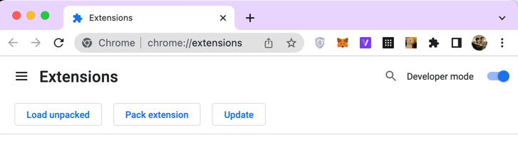
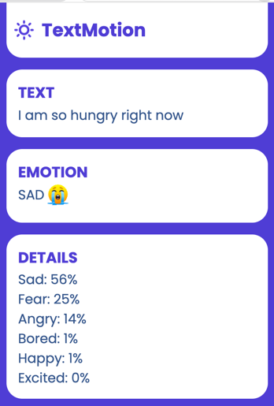

# TextMotion Chrome Extension 🤖🧑‍💻

A Chrome extension that detects the emotion in any piece of text,
without leaving the site you're on.
We need to select the text and then
click on the extension logo to get its emotion.

## How to install the extension

Download the `chrome-extension` folder. 

1. Turn on Developer mode on Chrome browser's extensions tab.

2. Click on `Load unpacked` button, as we can see in the previous picture.
3. Select the `chrome-extension` folder that was just downloaded.
4. The `TextMotion` extension will be added in your browser.(Pin it for ease-of-use)

## How to use the extension
Select any text on a tab and click on the extension
logo to detect its emotion. You can see probability
of every emotion by clicking on the `Details` button.

 

## Project Details
This repository contains three main folders:
1. **api**: This folder contains code of the flask-api that we are using.
`api.py` contains code that loads model and implements a basic Flask API.
2. **model-testing**: This folder contains python notebooks in which we have different models
to finally choose one we found best for our purpose.
3. **chrome-extension**: This folder contains the code for the Chrome extension.

## Further Goals
1. We've our API built, but we've not deployed it somewhere yet.
So, we used some third party api to develop the Chrome extension.
Our next target is to deploy the api and use that in our project.
2. After detecting emotions of texts, we also wish to detect emotions of pictures
users see on their page. We'll again use some pre-developed model. 

